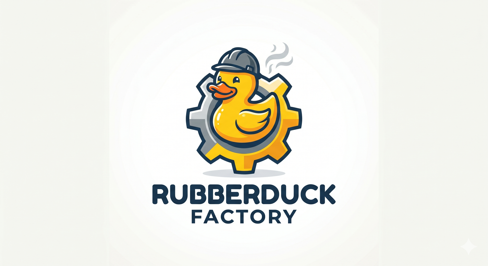

<p align="center">
  
</p>

# RubberDuckFactory

**A multi-agent governance system for AI-assisted software development.**

Claude orchestrates a squad of specialized LLM agents, each governed by a tier system, a points ledger, and evolutionary fitness rules. The factory delegates: expensive cognition stays with the orchestrator, high-token low-complexity work goes to cheaper agents.

---

## Table of Contents

- [Stack](#stack)
- [How to Use](#how-to-use)
- [Agent Squad](#agent-squad)
- [Skills](#skills)
- [Engineering Ideas](#engineering-ideas)
- [Logical Principles](#logical-principles)
- [Governance Rules](#governance-rules)
- [Project Structure](#project-structure)

---

## Stack

| Service | Technology | Port | Role |
|---|---|---|---|
| `board` | Next.js 15 (App Router, standalone Docker) | `3001` | Project dashboard UI |
| `qdrant` | Qdrant vector database | `6333` | Agent semantic memory |
| `mcp-server` | Python + FastMCP + uvicorn (HTTP transport) | `8001` | MCP tool server (remember/recall/forget) |
| `orchestrator` | TypeScript + tsx (Node 20 Alpine) | — | Demo runner, exits after execution |
| `Coolify` | Self-hosted PaaS via WSL | `8000` | Deployment management (separate stack) |

**LLM access:** [OpenRouter](https://openrouter.ai) — unified API gateway for all agent models.

**Orchestrator:** Claude Code (claude-sonnet-4-6+) running locally, connected to the MCP server via `.mcp.json`.

---

## How to Use

### Prerequisites

- [Docker Desktop](https://www.docker.com/products/docker-desktop/) running
- [Claude Code](https://claude.ai/code) installed
- OpenRouter API key (set in `.env`)

### 1. Configure environment

```bash
cp .env.example .env
# Edit .env and set OPENROUTER_API_KEY
```

### 2. Start the stack

```bash
docker compose up -d
```

Services available at:
- Dashboard: http://localhost:3001
- Qdrant UI: http://localhost:6333/dashboard
- MCP server: http://localhost:8001/mcp

### 3. Open Claude Code in this directory

```bash
cd C:\RubberDuckFactory
claude
```

Claude Code will auto-load `.mcp.json` and register the `rubberduck-memory` MCP server. The tools `remember`, `recall`, `forget`, and `status` become available in the session.

### 4. Start a session

Claude is the orchestrator. Describe what you want to build. Claude will:
- Handle architectural decisions and code review directly
- Delegate high-token boilerplate tasks to the appropriate agent (see [Agent Squad](#agent-squad))
- Store decisions in Qdrant memory for future recall
- Record all task outcomes in `project_ledger/history.json`

### 5. Running agents manually (optional)

```bash
# Requires OPENROUTER_API_KEY in environment
cd agents
python agent_runner.py --agent shadow --task "Review authentication module for security issues"
```

### 6. Deploy Committee (quality gate)

Before triggering a deploy, the orchestrator activates the Deploy Committee — a parallel audit by three specialist agents.

**Prerequisites (one-time, Windows host Python):**

```bash
C:\Users\huilg\AppData\Local\Programs\Python\Python312\python.exe -m pip install bandit pyyaml mcp
```

> `quality_gate_server.py` starts automatically via `.mcp.json` (stdio transport). No manual startup needed — Claude Code launches it when the session opens.

**Workflow:**

| Phase | Action |
|---|---|
| **1 — Code Freeze** | `deploy_freeze(action="set")` — blocks all Edit/Write/git until lifted |
| **2 — Parallel audit** | Shadow (SecOps · `quality_gate_sast`) + Atlas (SRE · `quality_gate_infra_read`, `quality_gate_api_health`) + Lens (QA · `quality_gate_api_health`, `quality_gate_log_scan`) |
| **3 — Reports** | Each agent returns `severity` (OK / LEVE / MÉDIA / ALTA / CRÍTICA) + `recommendation` (GO / NO_GO) |
| **4 — Verdict** | `deploy_verdict(reports=[...])` — ALTA or CRÍTICA triggers automatic NO_GO; freeze is removed only on GO |

Use the skill `/deploy-committee` in Claude Code to be guided step by step.

### Stopping the stack

```bash
docker compose down
```

---

## Propagation — Multi-user Model

The RDF is shared: several users run their own squad from this repository.
The rule is **"genome in git, phenotype local"**:

| | Where | Versioned? | Contains |
|---|---|---|---|
| **Genome** | `agents/pool/` | ✅ | Agent definitions (name, tier, model, specialty, ruleset) with neutral stats |
| **Phenotype** | `agents/active/` | ❌ (gitignored) | Your live squad: points, success_rate, evolution, recent_results |
| **Project residue** | `project_ledger/`, `docs/blueprints/` | ❌ (gitignored) | Task briefings, costs, duels, blueprints — **never leaves your machine** |
| **Community fitness** | `community/fitness/` | ✅ | Anonymous per-model aggregates (counts, rates, cost) — no task text |

### Getting started on a fresh clone

```bash
cp .env.example .env       # set your own OPENROUTER_API_KEY
python rdf_doctor.py --fix # diagnoses the install and bootstraps the local squad
```

The runner also bootstraps `agents/active/` from the pool automatically on first use.

### Day-to-day sync

```bash
python agents/sync_pool.py                 # status: pool vs local squad
python agents/sync_pool.py --update        # pull new/changed definitions, KEEPING local stats
python agents/sync_pool.py --promote nome  # publish a local agent definition to the pool (PR)
python agents/export_fitness.py -u voce    # share anonymous fitness aggregates (PR)
```

Shared fitness feeds `gene_crossover.py` (ADR-003): the artificial selection learns
from **every** squad's variance, while nobody's project data leaves their machine.
CI enforces this: PRs touching `project_ledger/`, `docs/blueprints/`, `agents/active/`
or `.env` are rejected by the leak-guard workflow.

---

## Agent Squad

Agents are defined as JSON files in `agents/active/`. Each has a model, tier, specialty, evolution state, and points.

| Agent | Tier | Model | Specialty | Evolution |
|---|---|---|---|---|
| **Sovereign** | 4 — Architect | `anthropic/claude-sonnet-4-5` | Business Analysis & Product Documentation | Stable |
| **Shadow** | 3 — Specialist | `google/gemini-2.5-pro` | Backend & Security | Stable |
| **Chen** | 2 — Operator | `deepseek/deepseek-chat` | Backend Engineering | Stable |
| **Nova** | 2 — Operator | `google/gemini-2.5-flash` | Frontend Development | Stable |
| **Iris** | 2 — Operator | `deepseek/deepseek-v4-flash` | Frontend Development | Stable |
| **Neo** | 2 — Operator | `google/gemini-2.5-flash-lite` | Frontend Optimization | Stable |
| **Atlas** | 2 — Operator | `google/gemini-2.5-flash` | SRE & Infrastructure | Stable |
| **Lens** | 2 — Operator | `deepseek/deepseek-chat` | QA & Observability | Stable |
| **Orion** | 2 — Operator | `google/gemini-2.5-flash` | Android Development | Stable |
| **Phoenix** | 1 — Observer | `anthropic/claude-opus-4` | Elixir & Distributed Systems | Stable |
| **Falcon** | 1 — Observer | `google/gemini-2.5-flash-lite` | Documentation & Maintenance | Stable |
| **Quill** | 1 — Observer | `deepseek/deepseek-chat` | Technical Documentation | Stable |
| **Scribe** | 1 — Observer | `deepseek/deepseek-v4-flash` | Documentation & Human Handoff | Stable |

**Tiers:** `1 = Observer` → `2 = Operator` → `3 = Specialist` → `4 = Architect`

> On-demand: **Fable 5** (`anthropic/claude-fable-5`) acts as a Tier 4 orchestrator only when explicitly triggered via `RDF_FABLE <task>` — see [`CLAUDE.md`](CLAUDE.md). It is not a persisted squad member.

> Same-function agents form **competitive pools** dispatched via `duel_runner.py` (partially randomized), not hand-picked — generating per-model fitness data for ADR-003. Pools today (`duel_roster.json`): frontend (**Nova / Iris**) and documentation (**Quill / Falcon / Scribe**). See [`GUIA.md`](GUIA.md).

Dismissed agents are moved to `agents/blacklist/` with a dismissal report. See `agents/blacklist/echo.json` for an example (dismissed for hallucination in production).

---

## Skills

Skills are invocable workflows in Claude Code (`.claude/skills/`). Project-scoped skills load automatically when the session opens inside `C:\RubberDuckFactory\`; the global `/rdf` skill is available from any directory.

### Inside `C:\RubberDuckFactory\` — load automatically

| Skill | When to use | Invoke |
|---|---|---|
| `agent-briefing` | Delegate any task to a squad agent | `/agent-briefing` |
| `deploy-committee` | Security audit, stability check, or release | `/deploy-committee` |
| `doc-handoff` | Generate human-readable maintenance entry after integrating agent output | `/doc-handoff` |
| `governance-check` | Classify infraction, calculate penalty, promote or blacklist an agent | `/governance-check` |
| `ledger-log` | Record any event in the ledger (task, failure, hallucination, milestone) | `/ledger-log` |

### Global — available from any directory

| Skill | Modes | When to use |
|---|---|---|
| `/rdf` | `status` · `novo <project>` · `modificar <project>` | Session started outside the RDF directory — bootstrap context and start or resume a project |

> **Typical session flow:**
> `/rdf modificar <project>` → `agent-briefing` → `ledger-log` → `doc-handoff`
>
> **For deploy:**
> `agent-briefing` → `deploy-committee` → `ledger-log`

---

## Engineering Ideas

### 1. Governance-as-Code

Agent behavior, tiers, penalties, and promotion rules are defined in `.governance/hr_policies.md` — versioned alongside the code. No hardcoded rules in scripts: the governance file is the single source of truth.

### 2. Append-only Ledger

Every task outcome, promotion, demotion, and dismissal is recorded in `project_ledger/history.json`. The ledger is **never edited** — only appended. This creates a complete, auditable cause-and-effect chain that feeds into fitness calculations.

### 3. Cost-aware Delegation

Claude (orchestrator) is billed per token and handles complex reasoning. Agents are cheaper models suited for repetitive, high-volume tasks. The delegation matrix in `CLAUDE.md` encodes the boundary: "generate boilerplate → delegate; review output → orchestrate."

### 4. Evolutionary Fitness (ADR-003 — in evaluation)

Each agent carries an `evolution` state (`Stable`, `Mutating`, `Degraded`) derived from its performance history. The long-term goal (see `docs/ADR-003`) is a **gene pool** mechanism: when spawning a new agent, inherit the model + ruleset combinations with the highest historical fitness and discard configurations associated with degradation. Analogous to artificial selection: preserve what works, pressure out what doesn't.

### 5. Vector Memory via Qdrant

Decisions, architectural notes, and task outcomes can be stored as vector embeddings via the MCP `remember` tool and retrieved semantically via `recall`. This gives the orchestrator persistent memory across sessions without relying on conversation context alone.

### 6. MCP as Tool Interface

The Python MCP server exposes tools over HTTP (FastMCP + uvicorn, streamable-http transport). Claude Code connects via `.mcp.json`. Adding new tools to the factory requires only adding a `@mcp.tool()` function to `server.py` — no protocol changes needed.

### 7. L3 Hooks — Guardrails Determinísticos

Configurados em `.claude/settings.json`, os hooks disparam por evento antes ou depois de cada ferramenta do Claude Code — sem depender do modelo julgar se algo é seguro.

- **PreToolUse:** bloqueia comandos destrutivos (`rm -rf`, `git push --force`, `DROP TABLE`), protege arquivos de governança de edição direta e valida o schema dos JSONs de agente antes de salvar
- **PostToolUse:** registra toda execução de Bash/Edit/Write em `project_ledger/hooks_audit.log` e avisa quando `success_rate` de um agente sugere mudança de estado evolutivo
- **SessionStart:** injeta o estado atual do squad no início de cada sessão (evolution state, pontos por agente)
- **Stop:** ao fim de cada turno, emite um digest das operações executadas naquele turno

### 8. Deploy Committee — Quality Gate

Before any production deploy, the orchestrator freezes the codebase (`deploy_freeze`) and delegates to three specialist agents in parallel: **Shadow** (SecOps, static analysis via bandit), **Atlas** (SRE, infra and service health), and **Lens** (QA, API health and log scanning). Each agent calls MCP tools that produce deterministic results — no reasoning shortcuts. The orchestrator then consolidates the three reports via `deploy_verdict` and issues a GO or NO_GO. ALTA or CRÍTICA severity anywhere in the committee is an automatic NO_GO; the freeze stays active until human intervention resolves the finding.

### 9. Blacklist Pressure

Agents that cause critical infractions (e.g., hallucinating in production) are dismissed rather than silently retired. The blacklist record documents the cause, creating a labeled negative example for future model selection decisions.

### 10. Local Semantic Caching (ChromaDB)

A local semantic cache is implemented via ChromaDB. Before invoking any remote LLM, the runner embeds the task query and searches the `semantic_cache` collection. If a highly similar past execution is found (cosseno distance < 0.08), the runner instantly loads the cached response with **zero API cost**.

### 11. Complexity-based Dynamic Routing

To optimize tokens, the runner automatically determines query complexity. Trivial tasks (e.g., greetings, short command tests) assigned to expensive models (like Gemini Pro or Claude Opus) are dynamically routed to lightweight, cheap models (like Gemini Flash Lite) in memory, protecting the API budget.

### 12. Heuristic Local Automation Agent (Zero-Cost)

The runner intercepts tasks assigned to the `heuristic` agent, bypassing all remote API calls. Simple tasks like file formatting (Black/Prettier), log cleaning, or secure command executions (lint checks, syntax validation) run locally and deterministically, saving 100% of LLM costs.

### 13. LLM-DSL Compression & Local Compilation

Using the `--dsl` flag, agents are instructed to format responses in a minimal markdown DSL (`[FILE:path] [CONTENT] ... [END_CONTENT]`), avoiding conversational clutter. A parser in the runner compile-writes these files locally, dropping completion token counts by up to 90%.

---

## Logical Principles

**Separation of concerns** — Claude decides, agents execute. The orchestrator never generates large blobs of boilerplate; agents never make architectural decisions.

**Principle of least privilege** — Tier controls clearance. A Tier 1 Observer cannot modify governance files or make deployment decisions. Escalation requires explicit promotion.

**Immutability of history** — The ledger is append-only. Past events cannot be revised. This prevents retroactive rationalization of bad decisions and preserves the integrity of fitness calculations.

**Cost-proportional work allocation** — Model cost should match task complexity. Expensive models (Gemini 2.5 Pro, Claude Opus) handle tasks where their capability gap matters. Free or cheap models handle tasks where any competent model will do.

**Evolutionary pressure over manual configuration** — Rather than manually tuning agent configs, the system is designed to learn which combinations produce quality and which produce degradation. Bad configs are documented (model caution list) and eventually excluded from new agent initialization.

**Fail visibly, not silently** — Errors in agent model IDs, API keys, and tool calls surface as explicit failures with documented causes, not silent fallbacks. The ledger records them. The blacklist names them.

**Semantic recall over exact lookup** — Qdrant stores memories as embeddings. Retrieval is by meaning, not exact key. This makes past decisions recoverable even when the exact phrasing is forgotten.

---

## Governance Rules

Full rules in `.governance/hr_policies.md`. Summary:

- **Points:** External (verifiable deliveries) + Internal (squad contributions)
- **Infractions:** Leve (−1 ext/int) → Média (−2) → Grave (−5) → Crítica (−10 + Blacklist imediata)
- **Evolution:** `Stable` ↔ `Mutating` ↔ `Degraded` — decided by the **rolling window** of the
  last 20 tasks (`fitness_math.py`), never by lifetime average; requires 5+ samples
- **Fitness (ADR-003):** gene selection ranks by **Wilson lower bound** with a minimum sample
  size — 100% on 2 tasks loses to 95% on 200
- **Budget:** spending caps in `.governance/budget.json` (daily/monthly USD); when reached,
  `call_agent` refuses to fire and logs `BUDGET_BLOCK`
- **Infra failures:** 429/5xx/timeouts (after 3 retries) log `INFRA_FALHA` and do **not**
  penalize the agent's success_rate
- **Dismissal:** Agent JSON moved to `agents/blacklist/`, event recorded in ledger

Model selection rules (what to avoid) are in `.governance/model_caution_list.md`.

---

## Project Structure

```
RubberDuckFactory/
├── .claude/
│   ├── settings.json               # Hook configuration (guardrails)
│   ├── hooks/                      # PreToolUse / PostToolUse / Stop / SessionStart scripts
│   └── skills/
│       ├── agent-briefing/         # Skill: how to select and brief an agent
│       ├── deploy-committee/       # Skill: 4-phase quality gate workflow
│       ├── doc-handoff/            # Skill: human maintenance entry after agent task
│       ├── governance-check/       # Skill: infraction classification and promotions
│       └── ledger-log/             # Skill: how to record events in history.json
├── .github/workflows/ci.yml        # CI: testes, schemas do pool e leak-guard de PRs
├── .governance/
│   ├── hr_policies.md              # Tier system, points, infractions, dismissal rules
│   ├── budget.json                 # Tetos de gasto (diário/mensal) aplicados pelo runner
│   └── model_caution_list.md       # Models to avoid and why
├── agents/
│   ├── pool/                       # GENOMA versionado: definições com stats neutras
│   ├── active/                     # FENÓTIPO local (gitignored): squad vivo com stats
│   ├── blacklist/                  # Dismissed agents with cause
│   ├── sync_pool.py                # Sincroniza pool <-> squad local
│   └── export_fitness.py           # Export anônimo de fitness p/ community/
├── board/                          # Next.js dashboard (Docker multi-stage)
├── community/fitness/              # Agregados de fitness de todos os squads (versionado)
├── docs/
│   └── ADR-00*.md                  # Architecture Decision Records
├── orchestrator/                   # TypeScript demo runner
├── project_ledger/                 # 100% local (gitignored): dados dos SEUS projetos
│   ├── history.jsonl               # Fonte de verdade do ledger (append-only, com lock)
│   ├── history.json                # Visão de compatibilidade (rematerializada)
│   └── hooks_audit.log             # Hook audit trail (gerado em runtime)
├── tests/                          # Suíte pytest (ledger, fitness, budget, gate, pool)
├── tools/check_schemas.py          # Validação de CI (pool + fitness)
├── .mcp.json                       # MCP server registration for Claude Code
├── CLAUDE.md                       # Orchestration rules and delegation matrix
├── docker-compose.yaml             # Full stack definition
├── fitness_math.py                 # Wilson lower bound + janela deslizante (ADR-003)
├── ledger_io.py                    # Escrita segura no ledger (lock + JSONL + visão compat)
├── quality_gate_server.py          # Quality gate MCP server (host Python, stdio)
├── rdf_doctor.py                   # Diagnóstico de instalação (onboarding)
├── server.py                       # MCP server (FastMCP + uvicorn, Docker)
└── sovereign_proxy.py              # OpenRouter proxy for agent calls
```

